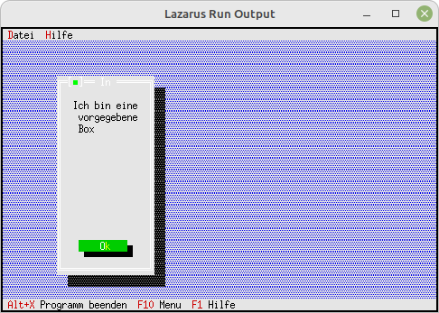

# 90 - Experimente
## 20 - Einfache MessageBox mit Dlg
<br>
<br><br>
Bei der MessageBox, kann man die Grösse auch manuell festlegen.<br>
Dazu muss man <b>MeassgeBoxRect(...)</b> verwenden.<br>
<hr><br>
Hier wird mir <b>R.Assign</b> die grösse der Box selbst festgelegt.<br>
```pascal  procedure TMyApp.HandleEvent(var Event: TEvent);
  var
    R: TRect;
    Dlg: PDialog;
  begin
    inherited HandleEvent(Event);
<br>
    if Event.What = evCommand then begin
      case Event.Command of
        cmAbout: begin
          R.Assign(12, 3, 58, 20);  // Grösse der Box
          Dlg := New(PDialog, Init(R, 'Parameter'));
          with Dlg^ do begin
<br>
            // CheckBoxen
            R.Assign(4, 3, 18, 7);
            Insert(New(PCheckBoxes, Init(R, NewSItem('~D~atei', NewSItem('~Z~eile',
              NewSItem('D~a~tum', NewSItem('~Z~eit', nil)))))));
<br>
            // BackGround
            GetExtent(R);
            R.Grow(-1, -1);
//            Insert(New(PBackGround, Init(R, #3)));  // Hintergrund einfügen.
<br>
            // My-Button
            R.Assign(7, 12, 17, 14);
            Insert(new(PButton, Init(R, '~M~yButton', cmMyBotton, bfDefault)));
<br>
          end;
<br>

          R.Assign(22, 3, 42, 10);  // Grösse der Box
          MessageBoxRectDlg(Dlg, R, 'Ich bin eine vorgegebene Box', nil, mfInformation + mfYesButton + mfNoButton);
          Dispose(Dlg, Done);
        end;
        cmMyBotton: begin
          MessageBox('Eigener Button gedrückt', nil, mfInformation);
<br>
        end
<br>

        else begin
          Exit;
        end;```
<br>
