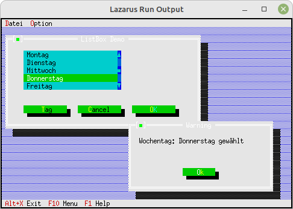

# 90 - Experimente
## 35 - HistoryViewer
 
  
Bei der TListBox muss man unbedingt mit einem Destructor den Speicher der TList freigeben. 
Dies ist nicht Free-Vision üblich. Dies hat auch einen Sinn, da man Listen vielfach global verwendet,  
ansonsten müsste man immer eine Kopie davon anlegen. 
Dort fehlt der <b>destructor</b>, welcher den Speicher aufräumt. 
---
---
<b>Unit mit dem neuen Dialog.</b> 
  
Der Dialog mit der ListBox 
<pre><code><b>unit</b> MyDialog;
</code></pre>
Den <b>Destructor</b> deklarieren, welcher den <b>Speicher</b> der List frei gibt. 
<pre><code><b>type</b>
  PMyDialog = ^TMyDialog;
  TMyDialog = <b>object</b>(TDialog)
    ListBox: PListBox;
    StringCollection: PUnSortedStrCollection;
 
    <b>constructor</b> Init;
    <b>destructor</b> Done; <b>virtual</b>;  <i>// Wegen Speicher Leak in TList</i>
    <b>procedure</b> HandleEvent(<b>var</b> Event: TEvent); <b>virtual</b>;
  <b>end</b>;
</code></pre>
Komponenten für den Dialog generieren. 
<pre><code><b>const</b>
  cmTag = 1000;  <i>// Lokale Event Konstante</i>
 
<b>constructor</b> TMyDialog.Init;
<b>var</b>
  R: TRect;
  HScrollBar, VScrollBar: PScrollBar;
  i: Integer;
  hw:PHistoryViewer;
<b>const</b>
  Tage: <b>array</b> [0..6] <b>of</b> shortstring = (
    'Montag', 'Dienstag', 'Mittwoch', 'Donnerstag', 'Freitag', 'Samstag', 'Sonntag');
 
<b>begin</b>
  R.Assign(10, 5, 64, 17);
  <b>inherited</b> Init(R, 'ListBox Demo');
 
  <i>// StringCollection</i>
  StringCollection := <b>new</b>(PUnSortedStrCollection, Init(5, 5));
  <b>for</b> i := 0 <b>to</b> Length(Tage) - 1 <b>do</b> <b>begin</b>
    StringCollection^.Insert(NewStr(Tage[i]));
  <b>end</b>;
 
  <i>// HScrollBar für ListBox</i>
  R.Assign(5, 7, 31, 8);
  HScrollBar := <b>new</b>(PScrollBar, Init(R));
  Insert(HScrollBar);
 
  <i>// VScrollBar für ListBox</i>
  R.Assign(31, 2, 32, 7);
  VScrollBar := <b>new</b>(PScrollBar, Init(R));
  Insert(VScrollBar);
 
  <i>//// ListBox</i>
  <i>//R.A.X := 5;</i>
  <i>//Dec(R.B.X, 1);</i>
  <i>//ListBox := new(PListBox, Init(R, 1, VScrollBar));</i>
  <i>//ListBox^.NewList(StringCollection);</i>
  <i>//Insert(ListBox);</i>
 
  <i>// ListBox</i>
  R.A.X := 5;
  Dec(R.B.X, 1);
  hw := <b>new</b>(PHistoryViewer, Init(R, HScrollBar, VScrollBar,1));
<i>//  hw^.NewList(StringCollection);</i>
  Insert(hw);
 

 
  <i>// Tag-Button</i>
  R.Assign(5, 9, 18, 11);
  Insert(<b>new</b>(PButton, Init(R, '~T~ag', cmTag, bfNormal)));
 
  <i>// Cancel-Button</i>
  R.Move(15, 0);
  Insert(<b>new</b>(PButton, Init(R, '~C~ancel', cmCancel, bfNormal)));
 
  <i>// Ok-Button</i>
  R.Move(15, 0);
  Insert(<b>new</b>(PButton, Init(R, '~O~K', cmOK, bfDefault)));
<b>end</b>;
</code></pre>
Manuell den Speicher der Liste frei geben. 
<pre><code><b>destructor</b> TMyDialog.Done;
<b>begin</b>
<i>//  Dispose(ListBox^.List, Done); // Die Liste freigeben</i>
  <b>inherited</b> Done;
<b>end</b>;
</code></pre>
Der EventHandle 
Wen man auf <b>[Tag]</b> klickt, wird der fokusierte Eintrag der ListBox angezeigt. 
<pre><code><b>procedure</b> TMyDialog.HandleEvent(<b>var</b> Event: TEvent);
<b>begin</b>
  <b>case</b> Event.What <b>of</b>
    evCommand: <b>begin</b>
      <b>case</b> Event.Command <b>of</b>
        cmOK: <b>begin</b>
          <i>// mache etwas</i>
        <b>end</b>;
        cmTag: <b>begin</b>
          <i>// Eintrag mit Fokus auslesen</i>
          <i>// Und ausgeben</i>
          MessageBox('Wochentag: ' + PString(ListBox^.GetFocusedItem)^ + ' gew' + #132 + 'hlt', <b>nil</b>, mfOKButton);
          <i>// Event beenden.</i>
          ClearEvent(Event);
        <b>end</b>;
      <b>end</b>;
    <b>end</b>;
  <b>end</b>;
  <b>inherited</b> HandleEvent(Event);
<b>end</b>;
</code></pre>
 
