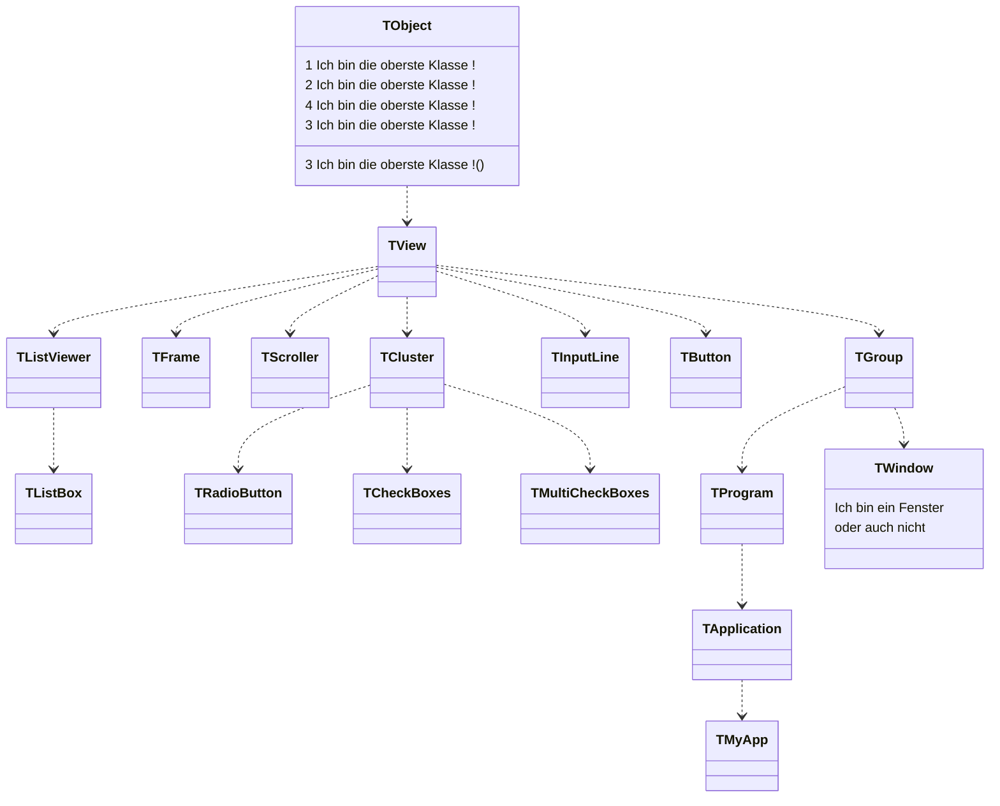
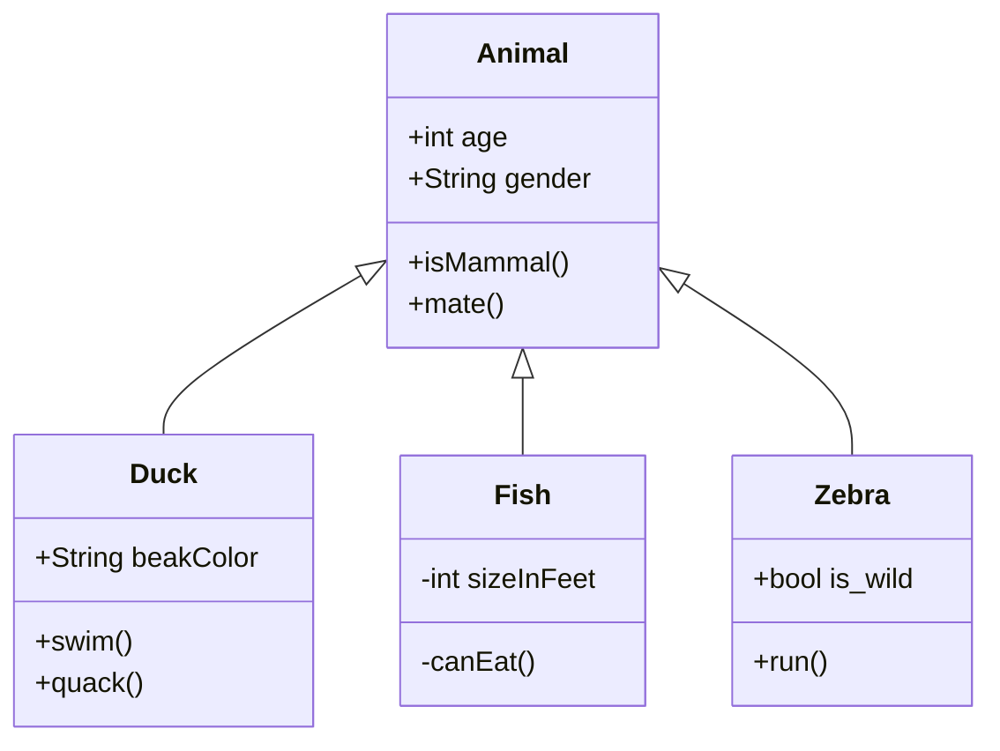

## Chart Test

```mermaid
classDiagram


TObject ..> TView
TObject : 1 Ich bin die oberste Klasse !
TObject : 2 Ich bin die oberste Klasse !
TObject: 3 Ich bin die oberste Klasse !()
TObject : 4 Ich bin die oberste Klasse !
TObject: 3 Ich bin die oberste Klasse !
TView ..> TGroup
TView ..> TFrame
TView ..> TScroller
TView ..> TListViewer
TListViewer ..> TListBox
TView ..> TInputLine
TView ..> TButton
TView ..> TCluster
TCluster ..> TRadioButton
TCluster ..> TCheckBoxes
TCluster ..> TMultiCheckBoxes
TGroup ..> TProgram
TGroup ..> TWindow
TProgram ..> TApplication 
TApplication ..> TMyApp
class TWindow {
  Ich bin ein Fenster
  oder auch nicht
}
```

```mermaid
 classDiagram
      Animal <|-- Duck
      Animal <|-- Fish
      Animal <|-- Zebra
      Animal : +int age
      Animal : +String gender
      Animal: +isMammal()
      Animal: +mate()
      class Duck{
          +String beakColor
          +swim()
          +quack()
      }
      class Fish{
          -int sizeInFeet
          -canEat()
      }
      class Zebra{
          +bool is_wild
          +run()
      }
```

