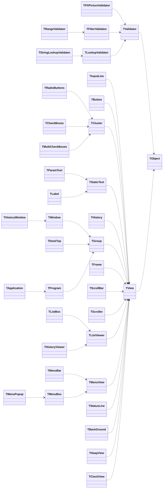
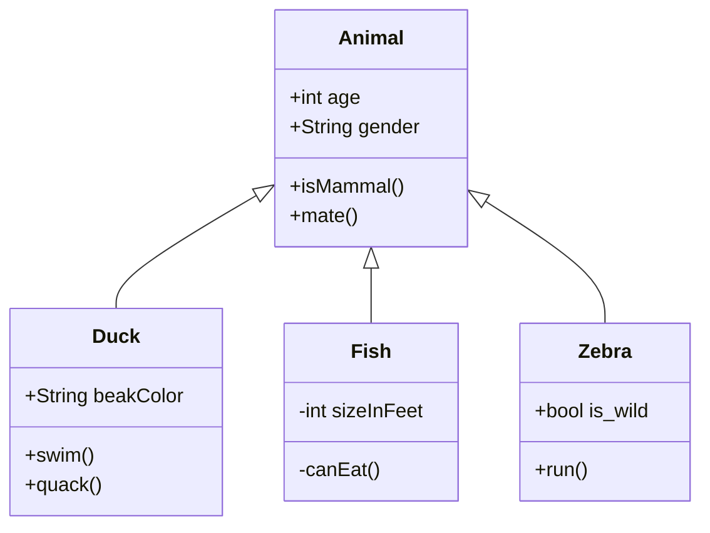

## Chart Test

```mermaid
classDiagram
direction LR

TInputLine..>TView
TButton..>TView
TCluster..>TView
TRadioButtons..>TCluster
TCheckBoxes..>TCluster
TMultiCheckBoxes..>TCluster
TListBox..>TListViewer
TStaticText..>TView
TParamText..>TStaticText
TLabel..>TStaticText
THistoryViewer..>TListViewer
THistoryWindow..>TWindow
THistory..>TView
TValidator..>TObject
TPXPictureValidator..>TValidator
TFilterValidator..>TValidator
TRangeValidator..>TFilterValidator
TLookupValidator..>TValidator
TStringLookupValidator..>TLookupValidator
TView..>TObject
TGroup..>TView
TFrame..>TView
TScrollBar..>TView
TScroller..>TView
TListViewer..>TView
TWindow..>TGroup
TMenuView..>TView
TMenuBar..>TMenuView
TMenuBox..>TMenuView
TMenuPopup..>TMenuBox
TStatusLine..>TView
TBackGround..>TView
TDeskTop..>TGroup
TProgram..>TGroup
TApplication..>TProgram
THeapView..>TView
TClockView..>TView
```

```mermaid
 classDiagram
      Animal <|-- Duck
      Animal <|-- Fish
      Animal <|-- Zebra
      Animal : +int age
      Animal : +String gender
      Animal: +isMammal()
      Animal: +mate()
      class Duck{
          +String beakColor
          +swim()
          +quack()
      }
      class Fish{
          -int sizeInFeet
          -canEat()
      }
      class Zebra{
          +bool is_wild
          +run()
      }
```

