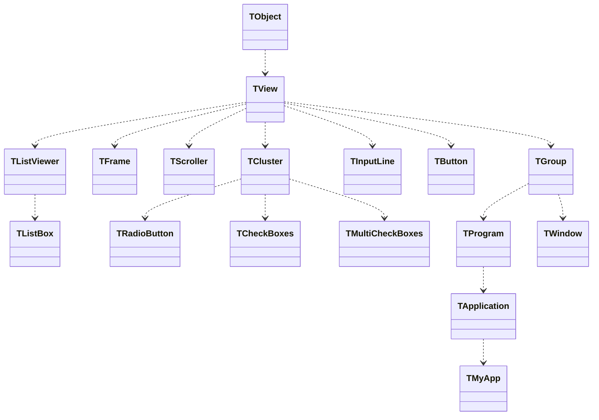

## Chart Test

```mermaid
classDiagram


TObject ..> TView
TView ..> TGroup
TView ..> TFrame
TView ..> TScroller
TView ..> TListViewer
TListViewer ..> TListBox
TView ..> TInputLine
TView ..> TButton
TView ..> TCluster
TCluster ..> TRadioButton
TCluster ..> TCheckBoxes
TCluster ..> TMultiCheckBoxes
TGroup ..> TProgram
TGroup ..> TWindow
TProgram ..> TApplication 
TApplication ..> TMyApp
```

