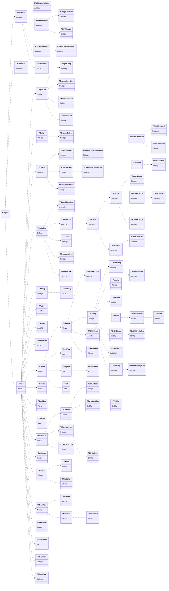

```mermaid
classDiagram
direction RL
TTimedDialog<..TDialog
TTimedDialog:timeddlg
TTimedDialogText<..TStaticText
TTimedDialogText:timeddlg
TInputLong<..TInputLine
TInputLong:InpLong
TInputLine<..TView
TInputLine:Dialogs
TButton<..TView
TButton:Dialogs
TCluster<..TView
TCluster:Dialogs
TRadioButtons<..TCluster
TRadioButtons:Dialogs
TCheckBoxes<..TCluster
TCheckBoxes:Dialogs
TMultiCheckBoxes<..TCluster
TMultiCheckBoxes:Dialogs
TListBox<..TListViewer
TListBox:Dialogs
TStaticText<..TView
TStaticText:Dialogs
TParamText<..TStaticText
TParamText:Dialogs
TLabel<..TStaticText
TLabel:Dialogs
THistoryViewer<..TListViewer
THistoryViewer:Dialogs
THistoryWindow<..TWindow
THistoryWindow:Dialogs
THistory<..TView
THistory:Dialogs
TBrowseInputLine<..TInputLine
TBrowseInputLine:Dialogs
TBrowseButton<..TButton
TBrowseButton:Dialogs
TCommandIcon<..TStaticText
TCommandIcon:Dialogs
TCommandCheckBoxes<..TCheckBoxes
TCommandCheckBoxes:Dialogs
TCommandRadioButtons<..TRadioButtons
TCommandRadioButtons:Dialogs
TEditListBox<..TListBox
TEditListBox:Dialogs
TModalInputLine<..TInputLine
TModalInputLine:Dialogs
TDialog<..TWindow
TDialog:Dialogs
TListDlg<..TDialog
TListDlg:Dialogs
TTable<..TView
TTable:AsciiTab
TReport<..TView
TReport:AsciiTab
TASCIIChart<..TWindow
TASCIIChart:AsciiTab
TValidator<..TObject
TValidator:Validate
TPXPictureValidator<..TValidator
TPXPictureValidator:Validate
TFilterValidator<..TValidator
TFilterValidator:Validate
TRangeValidator<..TFilterValidator
TRangeValidator:Validate
TLookupValidator<..TValidator
TLookupValidator:Validate
TStringLookupValidator<..TLookupValidator
TStringLookupValidator:Validate
TConstant<..TObject
TConstant:Resource
TMemStringList<..TSortedCollection
TMemStringList:Resource
TFileInputLine<..TInputLine
TFileInputLine:StdDlg
TFileCollection<..TSortedCollection
TFileCollection:StdDlg
TFileValidator<..TValidator
TFileValidator:StdDlg
TSortedListBox<..TListBox
TSortedListBox:StdDlg
TFileList<..TSortedListBox
TFileList:StdDlg
TFileInfoPane<..TView
TFileInfoPane:StdDlg
TFileHistory<..THistory
TFileHistory:StdDlg
TFileDialog<..TDialog
TFileDialog:StdDlg
TDirCollection<..TCollection
TDirCollection:StdDlg
TDirListBox<..TListBox
TDirListBox:StdDlg
TChDirDialog<..TDialog
TChDirDialog:StdDlg
TEditChDirDialog<..TChDirDialog
TEditChDirDialog:StdDlg
TDirValidator<..TFilterValidator
TDirValidator:StdDlg
TView<..TObject
TView:Views
TGroup<..TView
TGroup:Views
TFrame<..TView
TFrame:Views
TScrollBar<..TView
TScrollBar:Views
TScroller<..TView
TScroller:Views
TListViewer<..TView
TListViewer:Views
TWindow<..TGroup
TWindow:Views
Toutlineviewer<..Tscroller
Toutlineviewer:outline
Toutline<..Toutlineviewer
Toutline:outline
TIndicator<..TView
TIndicator:Editors
TEditor<..TView
TEditor:Editors
TMemo<..TEditor
TMemo:Editors
TFileEditor<..TEditor
TFileEditor:Editors
TEditWindow<..TWindow
TEditWindow:Editors
TMenuView<..TView
TMenuView:Menus
TMenuBar<..TMenuView
TMenuBar:Menus
TMenuBox<..TMenuView
TMenuBox:Menus
TMenuPopup<..TMenuBox
TMenuPopup:Menus
TStatusLine<..TView
TStatusLine:Menus
TColorGroupList<..TListViewer
TColorGroupList:ColorSel
TColorDialog<..TDialog
TColorDialog:ColorSel
TBackGround<..TView
TBackGround:App
TDeskTop<..TGroup
TDeskTop:App
TProgram<..TGroup
TProgram:App
TApplication<..TProgram
TApplication:App
TColoredText<..TStaticText
TColoredText:ColorTxt
THeapView<..TView
THeapView:Gadgets
TClockView<..TView
TClockView:Gadgets
TStatus<..TParamText
TStatus:Statuses
TStatusDlg<..TDialog
TStatusDlg:Statuses
TStatusMessageDlg<..TStatusDlg
TStatusMessageDlg:Statuses
TGauge<..TStatus
TGauge:Statuses
TArrowGauge<..TGauge
TArrowGauge:Statuses
TPercentGauge<..TGauge
TPercentGauge:Statuses
TBarGauge<..TPercentGauge
TBarGauge:Statuses
TSpinnerGauge<..TGauge
TSpinnerGauge:Statuses
TAppStatus<..TStatus
TAppStatus:Statuses
THeapMaxAvail<..TAppStatus
THeapMaxAvail:Statuses
THeapMemAvail<..TAppStatus
THeapMemAvail:Statuses
TTab<..TGroup
TTab:tabs
```
