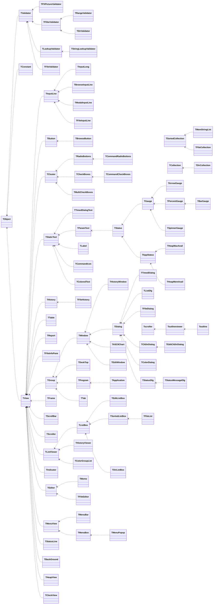

```mermaid
classDiagram
direction RL
TTimedDialog..>TDialog
TTimedDialogText..>TStaticText
TInputLong..>TInputLine
TInputLine..>TView
TButton..>TView
TCluster..>TView
TRadioButtons..>TCluster
TCheckBoxes..>TCluster
TMultiCheckBoxes..>TCluster
TListBox..>TListViewer
TStaticText..>TView
TParamText..>TStaticText
TLabel..>TStaticText
THistoryViewer..>TListViewer
THistoryWindow..>TWindow
THistory..>TView
TBrowseInputLine..>TInputLine
TBrowseButton..>TButton
TCommandIcon..>TStaticText
TCommandCheckBoxes..>TCheckBoxes
TCommandRadioButtons..>TRadioButtons
TEditListBox..>TListBox
TModalInputLine..>TInputLine
TDialog..>TWindow
TListDlg..>TDialog
TTable..>TView
TReport..>TView
TASCIIChart..>TWindow
TValidator..>TObject
TPXPictureValidator..>TValidator
TFilterValidator..>TValidator
TRangeValidator..>TFilterValidator
TLookupValidator..>TValidator
TStringLookupValidator..>TLookupValidator
TConstant..>TObject
TMemStringList..>TSortedCollection
TFileInputLine..>TInputLine
TFileCollection..>TSortedCollection
TFileValidator..>TValidator
TSortedListBox..>TListBox
TFileList..>TSortedListBox
TFileInfoPane..>TView
TFileHistory..>THistory
TFileDialog..>TDialog
TDirCollection..>TCollection
TDirListBox..>TListBox
TChDirDialog..>TDialog
TEditChDirDialog..>TChDirDialog
TDirValidator..>TFilterValidator
TView..>TObject
TGroup..>TView
TFrame..>TView
TScrollBar..>TView
TScroller..>TView
TListViewer..>TView
TWindow..>TGroup
Toutlineviewer..>Tscroller
Toutline..>Toutlineviewer
TIndicator..>TView
TEditor..>TView
TMemo..>TEditor
TFileEditor..>TEditor
TEditWindow..>TWindow
TMenuView..>TView
TMenuBar..>TMenuView
TMenuBox..>TMenuView
TMenuPopup..>TMenuBox
TStatusLine..>TView
TColorGroupList..>TListViewer
TColorDialog..>TDialog
TBackGround..>TView
TDeskTop..>TGroup
TProgram..>TGroup
TApplication..>TProgram
TColoredText..>TStaticText
THeapView..>TView
TClockView..>TView
TStatus..>TParamText
TStatusDlg..>TDialog
TStatusMessageDlg..>TStatusDlg
TGauge..>TStatus
TArrowGauge..>TGauge
TPercentGauge..>TGauge
TBarGauge..>TPercentGauge
TSpinnerGauge..>TGauge
TAppStatus..>TStatus
THeapMaxAvail..>TAppStatus
THeapMemAvail..>TAppStatus
TTab..>TGroup
```

