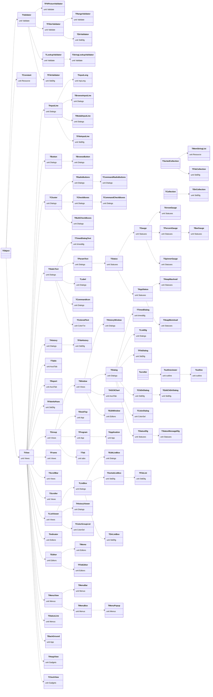

```mermaid
classDiagram
direction RL
TTimedDialog<..TDialog
TTimedDialog:unit timeddlg
TTimedDialogText<..TStaticText
TTimedDialogText:unit timeddlg
TInputLong<..TInputLine
TInputLong:unit InpLong
TInputLine<..TView
TInputLine:unit Dialogs
TButton<..TView
TButton:unit Dialogs
TCluster<..TView
TCluster:unit Dialogs
TRadioButtons<..TCluster
TRadioButtons:unit Dialogs
TCheckBoxes<..TCluster
TCheckBoxes:unit Dialogs
TMultiCheckBoxes<..TCluster
TMultiCheckBoxes:unit Dialogs
TListBox<..TListViewer
TListBox:unit Dialogs
TStaticText<..TView
TStaticText:unit Dialogs
TParamText<..TStaticText
TParamText:unit Dialogs
TLabel<..TStaticText
TLabel:unit Dialogs
THistoryViewer<..TListViewer
THistoryViewer:unit Dialogs
THistoryWindow<..TWindow
THistoryWindow:unit Dialogs
THistory<..TView
THistory:unit Dialogs
TBrowseInputLine<..TInputLine
TBrowseInputLine:unit Dialogs
TBrowseButton<..TButton
TBrowseButton:unit Dialogs
TCommandIcon<..TStaticText
TCommandIcon:unit Dialogs
TCommandCheckBoxes<..TCheckBoxes
TCommandCheckBoxes:unit Dialogs
TCommandRadioButtons<..TRadioButtons
TCommandRadioButtons:unit Dialogs
TEditListBox<..TListBox
TEditListBox:unit Dialogs
TModalInputLine<..TInputLine
TModalInputLine:unit Dialogs
TDialog<..TWindow
TDialog:unit Dialogs
TListDlg<..TDialog
TListDlg:unit Dialogs
TTable<..TView
TTable:unit AsciiTab
TReport<..TView
TReport:unit AsciiTab
TASCIIChart<..TWindow
TASCIIChart:unit AsciiTab
TValidator<..TObject
TValidator:unit Validate
TPXPictureValidator<..TValidator
TPXPictureValidator:unit Validate
TFilterValidator<..TValidator
TFilterValidator:unit Validate
TRangeValidator<..TFilterValidator
TRangeValidator:unit Validate
TLookupValidator<..TValidator
TLookupValidator:unit Validate
TStringLookupValidator<..TLookupValidator
TStringLookupValidator:unit Validate
TConstant<..TObject
TConstant:unit Resource
TMemStringList<..TSortedCollection
TMemStringList:unit Resource
TFileInputLine<..TInputLine
TFileInputLine:unit StdDlg
TFileCollection<..TSortedCollection
TFileCollection:unit StdDlg
TFileValidator<..TValidator
TFileValidator:unit StdDlg
TSortedListBox<..TListBox
TSortedListBox:unit StdDlg
TFileList<..TSortedListBox
TFileList:unit StdDlg
TFileInfoPane<..TView
TFileInfoPane:unit StdDlg
TFileHistory<..THistory
TFileHistory:unit StdDlg
TFileDialog<..TDialog
TFileDialog:unit StdDlg
TDirCollection<..TCollection
TDirCollection:unit StdDlg
TDirListBox<..TListBox
TDirListBox:unit StdDlg
TChDirDialog<..TDialog
TChDirDialog:unit StdDlg
TEditChDirDialog<..TChDirDialog
TEditChDirDialog:unit StdDlg
TDirValidator<..TFilterValidator
TDirValidator:unit StdDlg
TView<..TObject
TView:unit Views
TGroup<..TView
TGroup:unit Views
TFrame<..TView
TFrame:unit Views
TScrollBar<..TView
TScrollBar:unit Views
TScroller<..TView
TScroller:unit Views
TListViewer<..TView
TListViewer:unit Views
TWindow<..TGroup
TWindow:unit Views
Toutlineviewer<..Tscroller
Toutlineviewer:unit outline
Toutline<..Toutlineviewer
Toutline:unit outline
TIndicator<..TView
TIndicator:unit Editors
TEditor<..TView
TEditor:unit Editors
TMemo<..TEditor
TMemo:unit Editors
TFileEditor<..TEditor
TFileEditor:unit Editors
TEditWindow<..TWindow
TEditWindow:unit Editors
TMenuView<..TView
TMenuView:unit Menus
TMenuBar<..TMenuView
TMenuBar:unit Menus
TMenuBox<..TMenuView
TMenuBox:unit Menus
TMenuPopup<..TMenuBox
TMenuPopup:unit Menus
TStatusLine<..TView
TStatusLine:unit Menus
TColorGroupList<..TListViewer
TColorGroupList:unit ColorSel
TColorDialog<..TDialog
TColorDialog:unit ColorSel
TBackGround<..TView
TBackGround:unit App
TDeskTop<..TGroup
TDeskTop:unit App
TProgram<..TGroup
TProgram:unit App
TApplication<..TProgram
TApplication:unit App
TColoredText<..TStaticText
TColoredText:unit ColorTxt
THeapView<..TView
THeapView:unit Gadgets
TClockView<..TView
TClockView:unit Gadgets
TStatus<..TParamText
TStatus:unit Statuses
TStatusDlg<..TDialog
TStatusDlg:unit Statuses
TStatusMessageDlg<..TStatusDlg
TStatusMessageDlg:unit Statuses
TGauge<..TStatus
TGauge:unit Statuses
TArrowGauge<..TGauge
TArrowGauge:unit Statuses
TPercentGauge<..TGauge
TPercentGauge:unit Statuses
TBarGauge<..TPercentGauge
TBarGauge:unit Statuses
TSpinnerGauge<..TGauge
TSpinnerGauge:unit Statuses
TAppStatus<..TStatus
TAppStatus:unit Statuses
THeapMaxAvail<..TAppStatus
THeapMaxAvail:unit Statuses
THeapMemAvail<..TAppStatus
THeapMemAvail:unit Statuses
TTab<..TGroup
TTab:unit tabs
```
