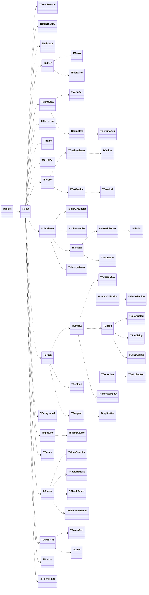

```mermaid
classDiagram
direction RL
TColorSelector<..TView
TMonoSelector<..TCluster
TColorDisplay<..TView
TColorGroupList<..TListViewer
TColorItemList<..TListViewer
TColorDialog<..TDialog
TIndicator<..TView
TEditor<..TView
TMemo<..TEditor
TFileEditor<..TEditor
TEditWindow<..TWindow
TMenuView<..TView
TMenuBar<..TMenuView
TMenuBox<..TMenuView
TMenuPopup<..TMenuBox
TStatusLine<..TView
TView<..TObject
TFrame<..TView
TScrollBar<..TView
TScroller<..TView
TListViewer<..TView
TGroup<..TView
TWindow<..TGroup
TBackground<..TView
TDesktop<..TGroup
TProgram<..TGroup
TApplication<..TProgram
TOutlineViewer<..TScroller
TOutline<..TOutlineViewer
TDialog<..TWindow
TInputLine<..TView
TButton<..TView
TCluster<..TView
TRadioButtons<..TCluster
TCheckBoxes<..TCluster
TMultiCheckBoxes<..TCluster
TListBox<..TListViewer
TStaticText<..TView
TParamText<..TStaticText
TLabel<..TStaticText
THistoryViewer<..TListViewer
THistoryWindow<..TWindow
THistory<..TView
TFileInputLine<..TInputLine
TFileCollection<..TSortedCollection
TSortedListBox<..TListBox
TFileList<..TSortedListBox
TFileInfoPane<..TView
TFileDialog<..TDialog
TDirCollection<..TCollection
TDirListBox<..TListBox
TChDirDialog<..TDialog
TTextDevice<..TScroller
TTerminal<..TTextDevice
```
