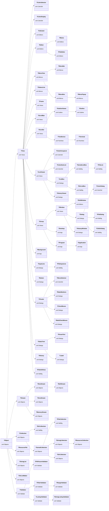

```mermaid
classDiagram
direction RL
TColorSelector<..TView
TColorSelector:unit ColorSel
TMonoSelector<..TCluster
TMonoSelector:unit ColorSel
TColorDisplay<..TView
TColorDisplay:unit ColorSel
TColorGroupList<..TListViewer
TColorGroupList:unit ColorSel
TColorItemList<..TListViewer
TColorItemList:unit ColorSel
TColorDialog<..TDialog
TColorDialog:unit ColorSel
TIndicator<..TView
TIndicator:unit Editors
TEditor<..TView
TEditor:unit Editors
TMemo<..TEditor
TMemo:unit Editors
TFileEditor<..TEditor
TFileEditor:unit Editors
TEditWindow<..TWindow
TEditWindow:unit Editors
TMenuView<..TView
TMenuView:unit Menus
TMenuBar<..TMenuView
TMenuBar:unit Menus
TMenuBox<..TMenuView
TMenuBox:unit Menus
TMenuPopup<..TMenuBox
TMenuPopup:unit Menus
TStatusLine<..TView
TStatusLine:unit Menus
TView<..TObject
TView:unit Views
TFrame<..TView
TFrame:unit Views
TScrollBar<..TView
TScrollBar:unit Views
TScroller<..TView
TScroller:unit Views
TListViewer<..TView
TListViewer:unit Views
TGroup<..TView
TGroup:unit Views
TWindow<..TGroup
TWindow:unit Views
TBackground<..TView
TBackground:unit App
TDesktop<..TGroup
TDesktop:unit App
TProgram<..TGroup
TProgram:unit App
TApplication<..TProgram
TApplication:unit App
TOutlineViewer<..TScroller
TOutlineViewer:unit Outline
TOutline<..TOutlineViewer
TOutline:unit Outline
TDialog<..TWindow
TDialog:unit Dialogs
TInputLine<..TView
TInputLine:unit Dialogs
TButton<..TView
TButton:unit Dialogs
TCluster<..TView
TCluster:unit Dialogs
TRadioButtons<..TCluster
TRadioButtons:unit Dialogs
TCheckBoxes<..TCluster
TCheckBoxes:unit Dialogs
TMultiCheckBoxes<..TCluster
TMultiCheckBoxes:unit Dialogs
TListBox<..TListViewer
TListBox:unit Dialogs
TStaticText<..TView
TStaticText:unit Dialogs
TParamText<..TStaticText
TParamText:unit Dialogs
TLabel<..TStaticText
TLabel:unit Dialogs
THistoryViewer<..TListViewer
THistoryViewer:unit Dialogs
THistoryWindow<..TWindow
THistoryWindow:unit Dialogs
THistory<..TView
THistory:unit Dialogs
TFileInputLine<..TInputLine
TFileInputLine:unit StdDlg
TFileCollection<..TSortedCollection
TFileCollection:unit StdDlg
TSortedListBox<..TListBox
TSortedListBox:unit StdDlg
TFileList<..TSortedListBox
TFileList:unit StdDlg
TFileInfoPane<..TView
TFileInfoPane:unit StdDlg
TFileDialog<..TDialog
TFileDialog:unit StdDlg
TDirCollection<..TCollection
TDirCollection:unit StdDlg
TDirListBox<..TListBox
TDirListBox:unit StdDlg
TChDirDialog<..TDialog
TChDirDialog:unit StdDlg
TTextDevice<..TScroller
TTextDevice:unit TextView
TTerminal<..TTextDevice
TTerminal:unit TextView
TStream<..TObject
TStream:unit Objects
TDosStream<..TStream
TDosStream:unit Objects
TBufStream<..TDosStream
TBufStream:unit Objects
TEmsStream<..TStream
TEmsStream:unit Objects
TMemoryStream<..TStream
TMemoryStream:unit Objects
TCollection<..TObject
TCollection:unit Objects
TSortedCollection<..TCollection
TSortedCollection:unit Objects
TStringCollection<..TSortedCollection
TStringCollection:unit Objects
TStrCollection<..TSortedCollection
TStrCollection:unit Objects
TResourceCollection<..TStringCollection
TResourceCollection:unit Objects
TResourceFile<..TObject
TResourceFile:unit Objects
TStringList<..TObject
TStringList:unit Objects
TStrListMaker<..TObject
TStrListMaker:unit Objects
TValidator<..TObject
TValidator:unit Validate
TPXPictureValidator<..TValidator
TPXPictureValidator:unit Validate
TFilterValidator<..TValidator
TFilterValidator:unit Validate
TRangeValidator<..TFilterValidator
TRangeValidator:unit Validate
TLookupValidator<..TValidator
TLookupValidator:unit Validate
TStringLookupValidator<..TLookupValidator
TStringLookupValidator:unit Validate
TObject:unit Objects
```
