# FPC FreeVision
## Einleitung
Hinweis: Die Sourcen auf GitHub sind aktueller als das Wiki. 
Auch befinden sich Beispiele auf GitHub, welche im Wiki nicht dokumentiert sind. 
## Tutorial
* [Einfuerung](#einfuerung)
* [Statuszeile_und_Menu](#statuszeile_und_menu)
* [Dialoge](#dialoge)
* [Dialoge_als_Komponente](#dialoge_als_komponente)
* [Listen_und_ListBoxen](#listen_und_listboxen)
* [EventHandle_auserhalb_Komponenten](#eventhandle_auserhalb_komponenten)
* [Komponenten_modifizieren](#komponenten_modifizieren)
* [Fenster](#fenster)
* [Editor](#editor)
* [TView](#tview)
* [Fertige_Dialoge](#fertige_dialoge)
* [Optische-Gestaltung](#optische-gestaltung)
* [Diverses](#diverses)
* [Gadgets](#gadgets)
* [Experimente](#experimente)
* [Test](#test)
 [testlink](#radiobutton)
### Einfuerung
| Link | Beschreibung
| :---: | ---
|Einleitung [Einleitung](01_-_Einfuerung/00_-_Einleitung/readme.md) | 
|Erster Desktop [Erster Desktop](01_-_Einfuerung/05_-_Erster_Desktop/readme.md) | 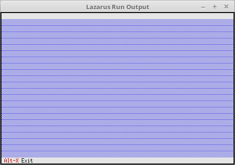
|Hello World [Hello World](01_-_Einfuerung/10_-_Hello_World/readme.md) | 
### Statuszeile und Menu
| Link | Beschreibung
| :---: | ---
|Status Zeile [Status Zeile](02_-_Statuszeile_und_Menu/00_-_Status_Zeile/readme.md) | 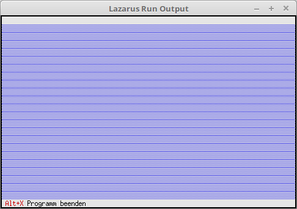
|Status Zeile mehrere Eintraege [Status Zeile mehrere Eintraege](02_-_Statuszeile_und_Menu/05_-_Status_Zeile_mehrere_Eintraege/readme.md) | 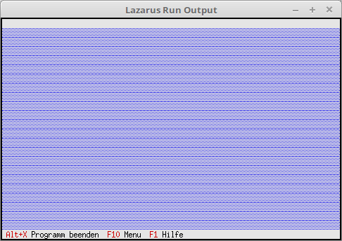
|Menu [Menu](02_-_Statuszeile_und_Menu/10_-_Menu/readme.md) | 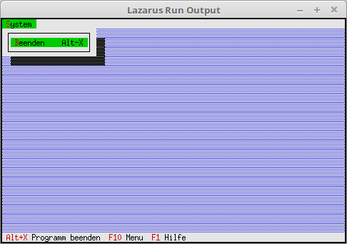
|Menu erweitert [Menu erweitert](02_-_Statuszeile_und_Menu/15_-_Menu_erweitert/readme.md) | 
|Menu verschachtelt [Menu verschachtelt](02_-_Statuszeile_und_Menu/20_-_Menu_verschachtelt/readme.md) | 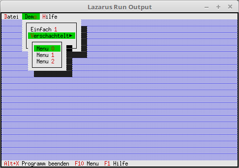
|Fertige Statuszeile und Menues [Fertige Statuszeile und Menues](02_-_Statuszeile_und_Menu/25_-_Fertige_Statuszeile_und_Menues/readme.md) | 
|Menu Hinweise [Menu Hinweise](02_-_Statuszeile_und_Menu/30_-_Menu_Hinweise/readme.md) | 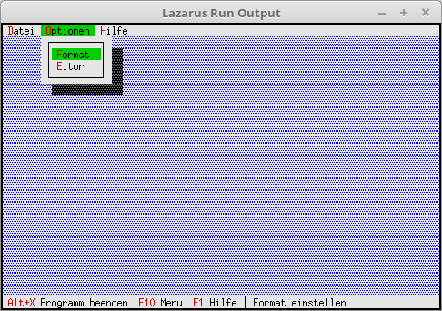
|Menu und Statuszeile tauschen [Menu und Statuszeile tauschen](02_-_Statuszeile_und_Menu/35_-_Menu_und_Statuszeile_tauschen/readme.md) | 
### Dialoge
| Link | Beschreibung
| :---: | ---
|Event abarbeiten [Event abarbeiten](03_-_Dialoge/00_-_Event_abarbeiten/readme.md) | 
|Erster Dialog [Erster Dialog](03_-_Dialoge/05_-_Erster_Dialog/readme.md) | 
|Button [Button](03_-_Dialoge/10_-_Button/readme.md) | 
|CheckBoxen [CheckBoxen](03_-_Dialoge/15_-_CheckBoxen/readme.md) | 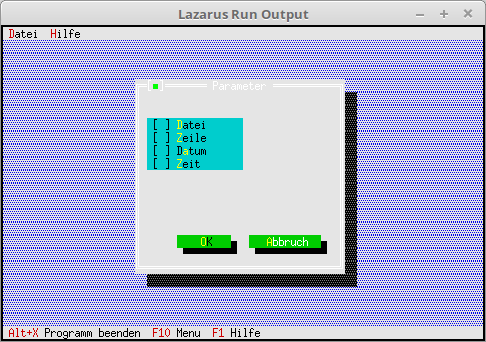
|RadioButton [RadioButton](03_-_Dialoge/20_-_RadioButton/readme.md) | 
|Bezeichnung fuer Check und Radio-Group [Bezeichnung fuer Check und Radio-Group](03_-_Dialoge/25_-_Bezeichnung_fuer_Check_und_Radio-Group/readme.md) | 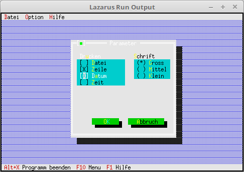
|InputLine (Edit-Zeile) [InputLine (Edit-Zeile)](03_-_Dialoge/30_-_InputLine_(Edit-Zeile)/readme.md) | 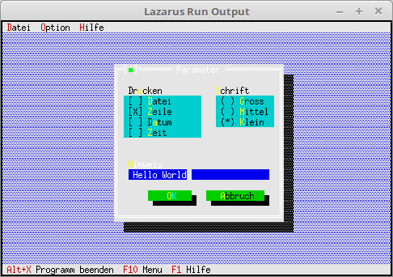
|Werte im Dialog merken [Werte im Dialog merken](03_-_Dialoge/35_-_Werte_im_Dialog_merken/readme.md) | 
|Freien Speicher ueberpruefen [Freien Speicher ueberpruefen](03_-_Dialoge/40_-_Freien_Speicher_ueberpruefen/readme.md) | 
|Werte des Dialoges auf Platte speichern [Werte des Dialoges auf Platte speichern](03_-_Dialoge/45_-_Werte_des_Dialoges_auf_Platte_speichern/readme.md) | 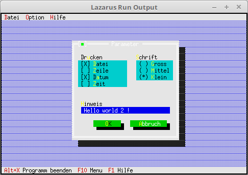
|StaticText gut fuer ein About [StaticText gut fuer ein About](03_-_Dialoge/50_-_StaticText_gut_fuer_ein_About/readme.md) | 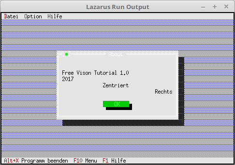
### Dialoge als Komponente
| Link | Beschreibung
| :---: | ---
|Ein einfaches About [Ein einfaches About](04_-_Dialoge_als_Komponente/00_-_Ein_einfaches_About/readme.md) | 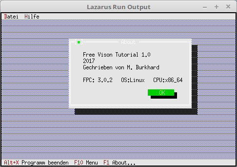
|Dialog mit lokalem Ereigniss [Dialog mit lokalem Ereigniss](04_-_Dialoge_als_Komponente/05_-_Dialog_mit_lokalem_Ereigniss/readme.md) | 
|Komponenten zur Laufzeit modifizieren [Komponenten zur Laufzeit modifizieren](04_-_Dialoge_als_Komponente/10_-_Komponenten_zur_Laufzeit_modifizieren/readme.md) | 
|Verschiedene Dialog Farben [Verschiedene Dialog Farben](04_-_Dialoge_als_Komponente/15_-_Verschiedene_Dialog_Farben/readme.md) | 
|Event an Dialog uebergeben [Event an Dialog uebergeben](04_-_Dialoge_als_Komponente/20_-_Event_an_Dialog_uebergeben/readme.md) | 
### Listen und ListBoxen
| Link | Beschreibung
| :---: | ---
|StringCollection unsortiert [StringCollection unsortiert](06_-_Listen_und_ListBoxen/00_-_StringCollection_unsortiert/readme.md) | 
|StringCollection sortiert [StringCollection sortiert](06_-_Listen_und_ListBoxen/05_-_StringCollection_sortiert/readme.md) | 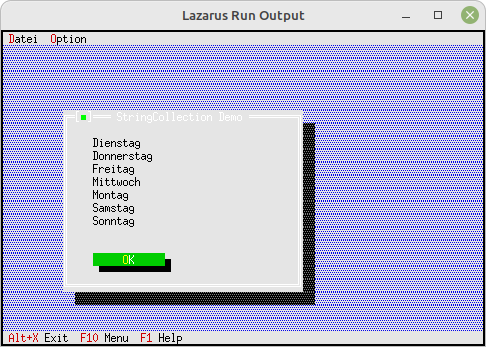
|ListBox unsortiert [ListBox unsortiert](06_-_Listen_und_ListBoxen/10_-_ListBox_unsortiert/readme.md) | 
|ListBox sortiert [ListBox sortiert](06_-_Listen_und_ListBoxen/15_-_ListBox_sortiert/readme.md) | 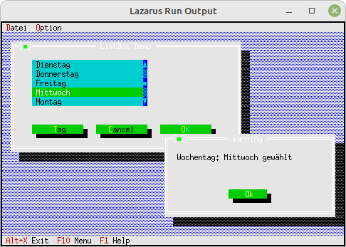
|ListBox mehrere Spalten [ListBox mehrere Spalten](06_-_Listen_und_ListBoxen/20_-_ListBox_mehrere_Spalten/readme.md) | 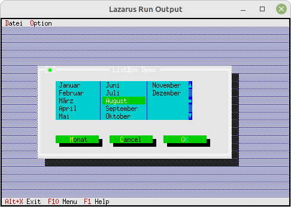
|ListBox einfuegen und entfernen von Eintraegen [ListBox einfuegen und entfernen von Eintraegen](06_-_Listen_und_ListBoxen/25_-_ListBox_einfuegen_und_entfernen_von_Eintraegen/readme.md) | 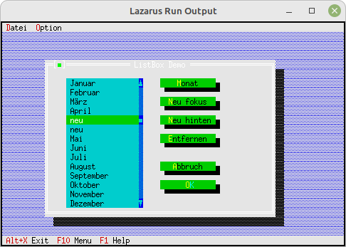
|ListBox Doppelklick [ListBox Doppelklick](06_-_Listen_und_ListBoxen/30_-_ListBox_Doppelklick/readme.md) | 
### EventHandle auserhalb Komponenten
| Link | Beschreibung
| :---: | ---
|Maus-Event [Maus-Event](08_-_EventHandle_auserhalb_Komponenten/00_-_Maus-Event/readme.md) | 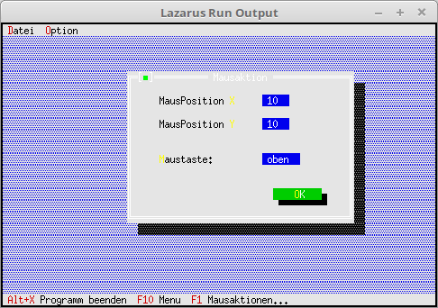
|Tastatur Event [Tastatur Event](08_-_EventHandle_auserhalb_Komponenten/05_-_Tastatur_Event/readme.md) | 
### Komponenten modifizieren
| Link | Beschreibung
| :---: | ---
|Button modifizieren [Button modifizieren](10_-_Komponenten_modifizieren/00_-_Button_modifizieren/readme.md) | 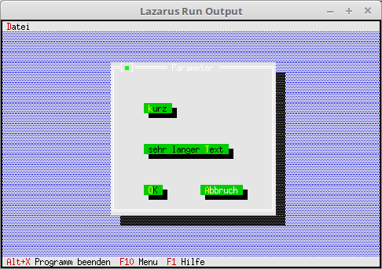
### Fenster
| Link | Beschreibung
| :---: | ---
|Erstes Fenster [Erstes Fenster](11_-_Fenster/00_-_Erstes_Fenster/readme.md) | 
|Fenster neu und schliessen [Fenster neu und schliessen](11_-_Fenster/05_-_Fenster_neu_und_schliessen/readme.md) | 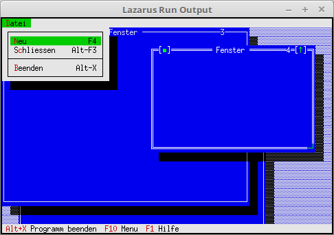
|Fenster verwalten [Fenster verwalten](11_-_Fenster/10_-_Fenster_verwalten/readme.md) | 
|Fenster mit Bedienelemte ausstatten [Fenster mit Bedienelemte ausstatten](11_-_Fenster/15_-_Fenster_mit_Bedienelemte_ausstatten/readme.md) | 
### Editor
| Link | Beschreibung
| :---: | ---
|Einfaches Editor-Fenster [Einfaches Editor-Fenster](12_-_Editor/00_-_Einfaches_Editor-Fenster/readme.md) | 
|Speichern und oeffnen [Speichern und oeffnen](12_-_Editor/05_-_Speichern_und_oeffnen/readme.md) | 
|Suchen Ersetzen [Suchen Ersetzen](12_-_Editor/10_-_Suchen_Ersetzen/readme.md) | 
|Zwischenablage [Zwischenablage](12_-_Editor/15_-_Zwischenablage/readme.md) | 
### TView
| Link | Beschreibung
| :---: | ---
|Einfachstes TView [Einfachstes TView](14_-_TView/00_-_Einfachstes_TView/readme.md) | 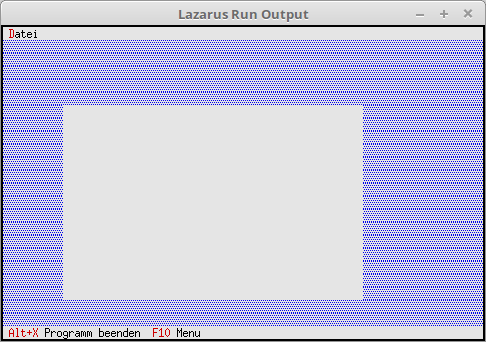
|TView erweitern [TView erweitern](14_-_TView/05_-_TView_erweitern/readme.md) | 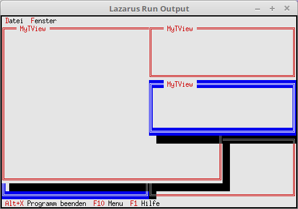
### Fertige Dialoge
| Link | Beschreibung
| :---: | ---
|Einfache MessageBox [Einfache MessageBox](15_-_Fertige_Dialoge/00_-_Einfache_MessageBox/readme.md) | 
|Einfache MessageBox mit Auswertung [Einfache MessageBox mit Auswertung](15_-_Fertige_Dialoge/05_-_Einfache_MessageBox_mit_Auswertung/readme.md) | 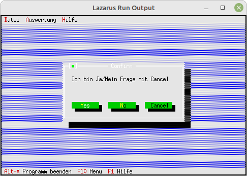
|Einfache MessageBox mit Vorgabe Rect [Einfache MessageBox mit Vorgabe Rect](15_-_Fertige_Dialoge/10_-_Einfache_MessageBox_mit_Vorgabe_Rect/readme.md) | 
|String-Eingabe Box [String-Eingabe Box](15_-_Fertige_Dialoge/15_-_String-Eingabe_Box/readme.md) | 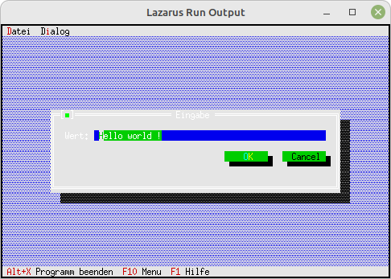
|Datei Dialoge [Datei Dialoge](15_-_Fertige_Dialoge/20_-_Datei_Dialoge/readme.md) | 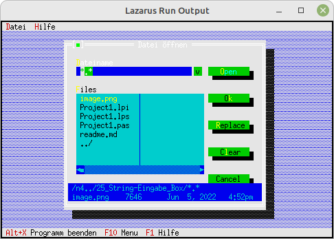
|Ordner wechseln [Ordner wechseln](15_-_Fertige_Dialoge/25_-_Ordner_wechseln/readme.md) | 
### Optische-Gestaltung
| Link | Beschreibung
| :---: | ---
|Desktop-Hintergrund Zeichen [Desktop-Hintergrund Zeichen](19_-_Optische-Gestaltung/00_--Desktop-Hintergrund_Zeichen/readme.md) | 
|Desktop-Hintergrund Farbe [Desktop-Hintergrund Farbe](19_-_Optische-Gestaltung/05_--Desktop-Hintergrund_Farbe/readme.md) | 
|Eigener Desktop Hintergrund [Eigener Desktop Hintergrund](19_-_Optische-Gestaltung/10_--Eigener_Desktop_Hintergrund/readme.md) | 
|Hintergrund auf Dialog [Hintergrund auf Dialog](19_-_Optische-Gestaltung/15_--Hintergrund_auf_Dialog/readme.md) | 
### Diverses
| Link | Beschreibung
| :---: | ---
|Idle Handle eine Uhr [Idle Handle eine Uhr](20_-_Diverses/00_-_Idle_Handle_eine_Uhr/readme.md) | 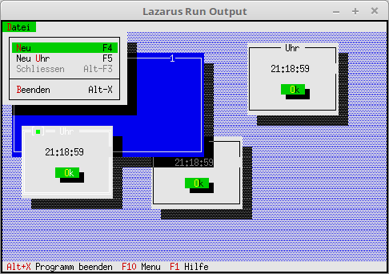
|String formatieren [String formatieren](20_-_Diverses/05_-_String_formatieren/readme.md) | 
|InputLine Validate [InputLine Validate](20_-_Diverses/10_-_InputLine_Validate/readme.md) | 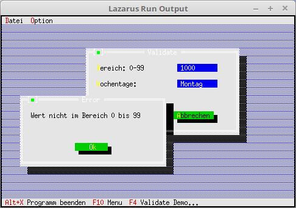
|Baum Ansicht [Baum Ansicht](20_-_Diverses/15_-_Baum_Ansicht/readme.md) | 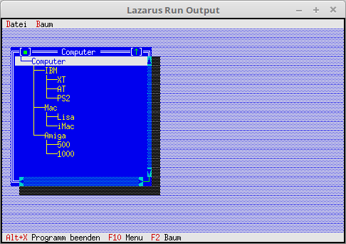
### Gadgets
| Link | Beschreibung
| :---: | ---
|RAM Verbrauch anzeigen (Heap) [RAM Verbrauch anzeigen (Heap)](30_-_Gadgets/00_-_RAM_Verbrauch_anzeigen_(Heap)/readme.md) | 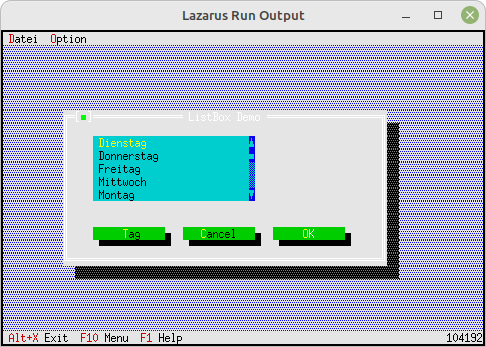
|Eine Uhr [Eine Uhr](30_-_Gadgets/05_-_Eine_Uhr/readme.md) | 
### Experimente
| Link | Beschreibung
| :---: | ---
|2 Menus [2 Menus](90_-_Experimente/00_-_2_Menus/readme.md) | 
|Menu graue Eintraege [Menu graue Eintraege](90_-_Experimente/05_-_Menu_graue_Eintraege/readme.md) | 
|2 Desktop [2 Desktop](90_-_Experimente/10_-_2_Desktop/readme.md) | 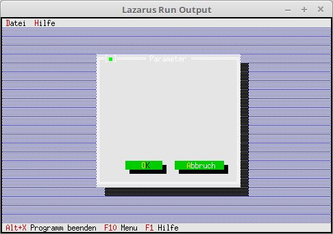
|Menu Box [Menu Box](90_-_Experimente/15_-_Menu_Box/readme.md) | 
|Einfache MessageBox mit Dlg [Einfache MessageBox mit Dlg](90_-_Experimente/20_-_Einfache_MessageBox_mit_Dlg/readme.md) | 
|Eintrag einfuegen [Eintrag einfuegen](90_-_Experimente/25_-_Eintrag_einfuegen/readme.md) | 
|EditListBox unsortiert [EditListBox unsortiert](90_-_Experimente/30_-_EditListBox_unsortiert/readme.md) | 
|HistoryViewer [HistoryViewer](90_-_Experimente/35_-_HistoryViewer/readme.md) | 
### Test
| Link | Beschreibung
| :---: | ---
|Komponenten zur Laufzeit modifizieren [Komponenten zur Laufzeit modifizieren](99_-_Test/00_-_Komponenten_zur_Laufzeit_modifizieren/readme.md) | 
|TabSheet [TabSheet](99_-_Test/05_-_TabSheet/readme.md) | 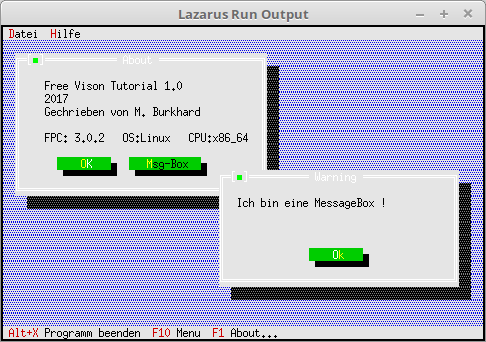
|ListBox [ListBox](99_-_Test/10_-_ListBox/readme.md) | 
|ListBox Heap [ListBox Heap](99_-_Test/15_-_ListBox_Heap/readme.md) | 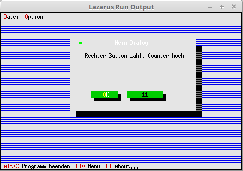
