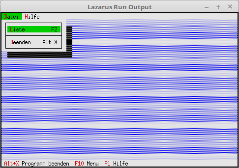
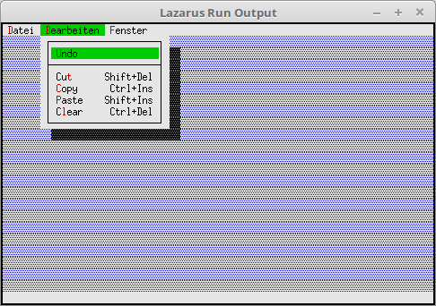
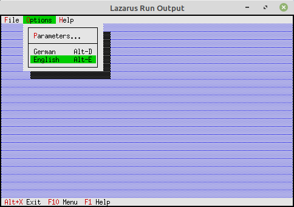
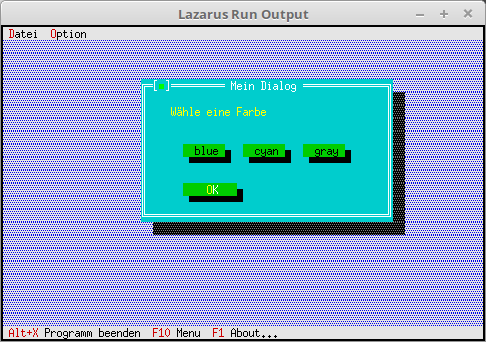
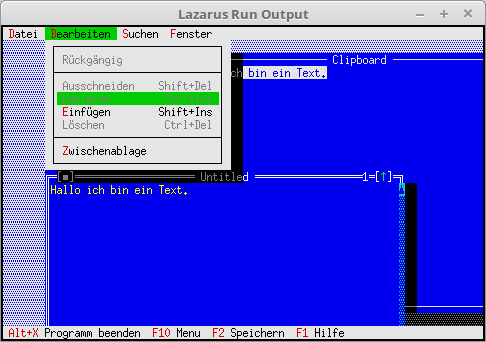
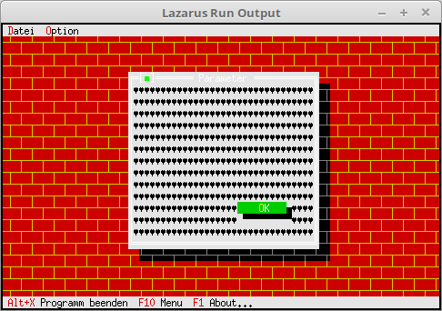
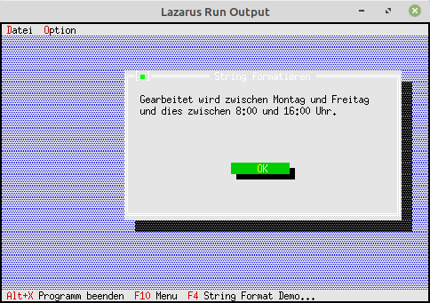
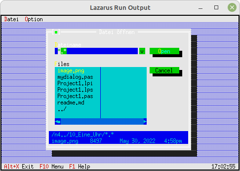

# FPC FreeVision
## Einleitung
Hinweis: Die Sourcen auf GitHub sind aktueller als das Wiki. 
Auch befinden sich Beispiele auf GitHub, welche im Wiki nicht dokumentiert sind. 
## Tutorial
* [Einfuerung](#einfuerung)
* [Statuszeile_und_Menu](#statuszeile_und_menu)
* [Dialoge](#dialoge)
* [Dialoge_als_Komponente](#dialoge_als_komponente)
* [Listen_und_ListBoxen](#listen_und_listboxen)
* [EventHandle_auserhalb_Komponenten](#eventhandle_auserhalb_komponenten)
* [Komponenten_modifizieren](#komponenten_modifizieren)
* [Fenster](#fenster)
* [Editor](#editor)
* [TView](#tview)
* [Fertige_Dialoge](#fertige_dialoge)
* [Optische-Gestaltung](#optische-gestaltung)
* [Diverses](#diverses)
* [Gadgets](#gadgets)
* [Experimente](#experimente)
* [Test](#test)
### Einfuerung
| Link | Beschreibung
| :---: | ---
| [####01_-_Einfuerung/00_-_Einleitung Einleitung](01_-_Einfuerung/00_-_Einleitung/readme.md) | 
| [####01_-_Einfuerung/05_-_Erster_Desktop Erster Desktop](01_-_Einfuerung/05_-_Erster_Desktop/readme.md) | 
| [####01_-_Einfuerung/10_-_Hello_World Hello World](01_-_Einfuerung/10_-_Hello_World/readme.md) | 
### Statuszeile und Menu
| Link | Beschreibung
| :---: | ---
| [####02_-_Statuszeile_und_Menu/00_-_Status_Zeile Status Zeile](02_-_Statuszeile_und_Menu/00_-_Status_Zeile/readme.md) | 
| [####02_-_Statuszeile_und_Menu/05_-_Status_Zeile_mehrere_Eintraege Status Zeile mehrere Eintraege](02_-_Statuszeile_und_Menu/05_-_Status_Zeile_mehrere_Eintraege/readme.md) | 
| [####02_-_Statuszeile_und_Menu/10_-_Menu Menu](02_-_Statuszeile_und_Menu/10_-_Menu/readme.md) | 
| [####02_-_Statuszeile_und_Menu/15_-_Menu_erweitert Menu erweitert](02_-_Statuszeile_und_Menu/15_-_Menu_erweitert/readme.md) | 
| [####02_-_Statuszeile_und_Menu/20_-_Menu_verschachtelt Menu verschachtelt](02_-_Statuszeile_und_Menu/20_-_Menu_verschachtelt/readme.md) | 
| [####02_-_Statuszeile_und_Menu/25_-_Fertige_Statuszeile_und_Menues Fertige Statuszeile und Menues](02_-_Statuszeile_und_Menu/25_-_Fertige_Statuszeile_und_Menues/readme.md) | 
| [####02_-_Statuszeile_und_Menu/30_-_Menu_Hinweise Menu Hinweise](02_-_Statuszeile_und_Menu/30_-_Menu_Hinweise/readme.md) | 
| [####02_-_Statuszeile_und_Menu/35_-_Menu_und_Statuszeile_tauschen Menu und Statuszeile tauschen](02_-_Statuszeile_und_Menu/35_-_Menu_und_Statuszeile_tauschen/readme.md) | 
### Dialoge
| Link | Beschreibung
| :---: | ---
| [####03_-_Dialoge/00_-_Event_abarbeiten Event abarbeiten](03_-_Dialoge/00_-_Event_abarbeiten/readme.md) | 
| [####03_-_Dialoge/05_-_Erster_Dialog Erster Dialog](03_-_Dialoge/05_-_Erster_Dialog/readme.md) | 
| [####03_-_Dialoge/10_-_Button Button](03_-_Dialoge/10_-_Button/readme.md) | 
| [####03_-_Dialoge/15_-_CheckBoxen CheckBoxen](03_-_Dialoge/15_-_CheckBoxen/readme.md) | 
| [####03_-_Dialoge/20_-_RadioButton RadioButton](03_-_Dialoge/20_-_RadioButton/readme.md) | 
| [####03_-_Dialoge/25_-_Bezeichnung_fuer_Check_und_Radio-Group Bezeichnung fuer Check und Radio-Group](03_-_Dialoge/25_-_Bezeichnung_fuer_Check_und_Radio-Group/readme.md) | 
| [####03_-_Dialoge/30_-_InputLine_(Edit-Zeile) InputLine (Edit-Zeile)](03_-_Dialoge/30_-_InputLine_(Edit-Zeile)/readme.md) | 
| [####03_-_Dialoge/35_-_Werte_im_Dialog_merken Werte im Dialog merken](03_-_Dialoge/35_-_Werte_im_Dialog_merken/readme.md) | 
| [####03_-_Dialoge/40_-_Freien_Speicher_ueberpruefen Freien Speicher ueberpruefen](03_-_Dialoge/40_-_Freien_Speicher_ueberpruefen/readme.md) | 
| [####03_-_Dialoge/45_-_Werte_des_Dialoges_auf_Platte_speichern Werte des Dialoges auf Platte speichern](03_-_Dialoge/45_-_Werte_des_Dialoges_auf_Platte_speichern/readme.md) | 
| [####03_-_Dialoge/50_-_StaticText_gut_fuer_ein_About StaticText gut fuer ein About](03_-_Dialoge/50_-_StaticText_gut_fuer_ein_About/readme.md) | 
### Dialoge als Komponente
| Link | Beschreibung
| :---: | ---
| [####04_-_Dialoge_als_Komponente/00_-_Ein_einfaches_About Ein einfaches About](04_-_Dialoge_als_Komponente/00_-_Ein_einfaches_About/readme.md) | 
| [####04_-_Dialoge_als_Komponente/05_-_Dialog_mit_lokalem_Ereigniss Dialog mit lokalem Ereigniss](04_-_Dialoge_als_Komponente/05_-_Dialog_mit_lokalem_Ereigniss/readme.md) | 
| [####04_-_Dialoge_als_Komponente/10_-_Komponenten_zur_Laufzeit_modifizieren Komponenten zur Laufzeit modifizieren](04_-_Dialoge_als_Komponente/10_-_Komponenten_zur_Laufzeit_modifizieren/readme.md) | 
| [####04_-_Dialoge_als_Komponente/15_-_Verschiedene_Dialog_Farben Verschiedene Dialog Farben](04_-_Dialoge_als_Komponente/15_-_Verschiedene_Dialog_Farben/readme.md) | 
| [####04_-_Dialoge_als_Komponente/20_-_Event_an_Dialog_uebergeben Event an Dialog uebergeben](04_-_Dialoge_als_Komponente/20_-_Event_an_Dialog_uebergeben/readme.md) | 
### Listen und ListBoxen
| Link | Beschreibung
| :---: | ---
| [####06_-_Listen_und_ListBoxen/00_-_StringCollection_unsortiert StringCollection unsortiert](06_-_Listen_und_ListBoxen/00_-_StringCollection_unsortiert/readme.md) | 
| [####06_-_Listen_und_ListBoxen/05_-_StringCollection_sortiert StringCollection sortiert](06_-_Listen_und_ListBoxen/05_-_StringCollection_sortiert/readme.md) | 
| [####06_-_Listen_und_ListBoxen/10_-_ListBox_unsortiert ListBox unsortiert](06_-_Listen_und_ListBoxen/10_-_ListBox_unsortiert/readme.md) | 
| [####06_-_Listen_und_ListBoxen/15_-_ListBox_sortiert ListBox sortiert](06_-_Listen_und_ListBoxen/15_-_ListBox_sortiert/readme.md) | 
| [####06_-_Listen_und_ListBoxen/20_-_ListBox_mehrere_Spalten ListBox mehrere Spalten](06_-_Listen_und_ListBoxen/20_-_ListBox_mehrere_Spalten/readme.md) | 
| [####06_-_Listen_und_ListBoxen/25_-_ListBox_einfuegen_und_entfernen_von_Eintraegen ListBox einfuegen und entfernen von Eintraegen](06_-_Listen_und_ListBoxen/25_-_ListBox_einfuegen_und_entfernen_von_Eintraegen/readme.md) | 
| [####06_-_Listen_und_ListBoxen/30_-_ListBox_Doppelklick ListBox Doppelklick](06_-_Listen_und_ListBoxen/30_-_ListBox_Doppelklick/readme.md) | 
### EventHandle auserhalb Komponenten
| Link | Beschreibung
| :---: | ---
| [####08_-_EventHandle_auserhalb_Komponenten/00_-_Maus-Event Maus-Event](08_-_EventHandle_auserhalb_Komponenten/00_-_Maus-Event/readme.md) | 
| [####08_-_EventHandle_auserhalb_Komponenten/05_-_Tastatur_Event Tastatur Event](08_-_EventHandle_auserhalb_Komponenten/05_-_Tastatur_Event/readme.md) | 
### Komponenten modifizieren
| Link | Beschreibung
| :---: | ---
| [####10_-_Komponenten_modifizieren/00_-_Button_modifizieren Button modifizieren](10_-_Komponenten_modifizieren/00_-_Button_modifizieren/readme.md) | 
### Fenster
| Link | Beschreibung
| :---: | ---
| [####11_-_Fenster/00_-_Erstes_Fenster Erstes Fenster](11_-_Fenster/00_-_Erstes_Fenster/readme.md) | 
| [####11_-_Fenster/05_-_Fenster_neu_und_schliessen Fenster neu und schliessen](11_-_Fenster/05_-_Fenster_neu_und_schliessen/readme.md) | 
| [####11_-_Fenster/10_-_Fenster_verwalten Fenster verwalten](11_-_Fenster/10_-_Fenster_verwalten/readme.md) | 
| [####11_-_Fenster/15_-_Fenster_mit_Bedienelemte_ausstatten Fenster mit Bedienelemte ausstatten](11_-_Fenster/15_-_Fenster_mit_Bedienelemte_ausstatten/readme.md) | 
### Editor
| Link | Beschreibung
| :---: | ---
| [####12_-_Editor/00_-_Einfaches_Editor-Fenster Einfaches Editor-Fenster](12_-_Editor/00_-_Einfaches_Editor-Fenster/readme.md) | 
| [####12_-_Editor/05_-_Speichern_und_oeffnen Speichern und oeffnen](12_-_Editor/05_-_Speichern_und_oeffnen/readme.md) | 
| [####12_-_Editor/10_-_Suchen_Ersetzen Suchen Ersetzen](12_-_Editor/10_-_Suchen_Ersetzen/readme.md) | 
| [####12_-_Editor/15_-_Zwischenablage Zwischenablage](12_-_Editor/15_-_Zwischenablage/readme.md) | 
### TView
| Link | Beschreibung
| :---: | ---
| [####14_-_TView/00_-_Einfachstes_TView Einfachstes TView](14_-_TView/00_-_Einfachstes_TView/readme.md) | 
| [####14_-_TView/05_-_TView_erweitern TView erweitern](14_-_TView/05_-_TView_erweitern/readme.md) | 
### Fertige Dialoge
| Link | Beschreibung
| :---: | ---
| [####15_-_Fertige_Dialoge/00_-_Einfache_MessageBox Einfache MessageBox](15_-_Fertige_Dialoge/00_-_Einfache_MessageBox/readme.md) | 
| [####15_-_Fertige_Dialoge/05_-_Einfache_MessageBox_mit_Auswertung Einfache MessageBox mit Auswertung](15_-_Fertige_Dialoge/05_-_Einfache_MessageBox_mit_Auswertung/readme.md) | 
| [####15_-_Fertige_Dialoge/10_-_Einfache_MessageBox_mit_Vorgabe_Rect Einfache MessageBox mit Vorgabe Rect](15_-_Fertige_Dialoge/10_-_Einfache_MessageBox_mit_Vorgabe_Rect/readme.md) | 
| [####15_-_Fertige_Dialoge/15_-_String-Eingabe_Box String-Eingabe Box](15_-_Fertige_Dialoge/15_-_String-Eingabe_Box/readme.md) | 
| [####15_-_Fertige_Dialoge/20_-_Datei_Dialoge Datei Dialoge](15_-_Fertige_Dialoge/20_-_Datei_Dialoge/readme.md) | 
| [####15_-_Fertige_Dialoge/25_-_Ordner_wechseln Ordner wechseln](15_-_Fertige_Dialoge/25_-_Ordner_wechseln/readme.md) | 
### Optische-Gestaltung
| Link | Beschreibung
| :---: | ---
| [####19_-_Optische-Gestaltung/00_--Desktop-Hintergrund_Zeichen Desktop-Hintergrund Zeichen](19_-_Optische-Gestaltung/00_--Desktop-Hintergrund_Zeichen/readme.md) | 
| [####19_-_Optische-Gestaltung/05_--Desktop-Hintergrund_Farbe Desktop-Hintergrund Farbe](19_-_Optische-Gestaltung/05_--Desktop-Hintergrund_Farbe/readme.md) | 
| [####19_-_Optische-Gestaltung/10_--Eigener_Desktop_Hintergrund Eigener Desktop Hintergrund](19_-_Optische-Gestaltung/10_--Eigener_Desktop_Hintergrund/readme.md) | 
| [####19_-_Optische-Gestaltung/15_--Hintergrund_auf_Dialog Hintergrund auf Dialog](19_-_Optische-Gestaltung/15_--Hintergrund_auf_Dialog/readme.md) | 
### Diverses
| Link | Beschreibung
| :---: | ---
| [####20_-_Diverses/00_-_Idle_Handle_eine_Uhr Idle Handle eine Uhr](20_-_Diverses/00_-_Idle_Handle_eine_Uhr/readme.md) | 
| [####20_-_Diverses/05_-_String_formatieren String formatieren](20_-_Diverses/05_-_String_formatieren/readme.md) | 
| [####20_-_Diverses/10_-_InputLine_Validate InputLine Validate](20_-_Diverses/10_-_InputLine_Validate/readme.md) | 
| [####20_-_Diverses/15_-_Baum_Ansicht Baum Ansicht](20_-_Diverses/15_-_Baum_Ansicht/readme.md) | 
### Gadgets
| Link | Beschreibung
| :---: | ---
| [####30_-_Gadgets/00_-_RAM_Verbrauch_anzeigen_(Heap) RAM Verbrauch anzeigen (Heap)](30_-_Gadgets/00_-_RAM_Verbrauch_anzeigen_(Heap)/readme.md) | 
| [####30_-_Gadgets/05_-_Eine_Uhr Eine Uhr](30_-_Gadgets/05_-_Eine_Uhr/readme.md) | 
### Experimente
| Link | Beschreibung
| :---: | ---
| [####90_-_Experimente/00_-_2_Menus 2 Menus](90_-_Experimente/00_-_2_Menus/readme.md) | 
| [####90_-_Experimente/05_-_Menu_graue_Eintraege Menu graue Eintraege](90_-_Experimente/05_-_Menu_graue_Eintraege/readme.md) | 
| [####90_-_Experimente/10_-_2_Desktop 2 Desktop](90_-_Experimente/10_-_2_Desktop/readme.md) | 
| [####90_-_Experimente/15_-_Menu_Box Menu Box](90_-_Experimente/15_-_Menu_Box/readme.md) | 
| [####90_-_Experimente/20_-_Einfache_MessageBox_mit_Dlg Einfache MessageBox mit Dlg](90_-_Experimente/20_-_Einfache_MessageBox_mit_Dlg/readme.md) | 
| [####90_-_Experimente/25_-_Eintrag_einfuegen Eintrag einfuegen](90_-_Experimente/25_-_Eintrag_einfuegen/readme.md) | 
| [####90_-_Experimente/30_-_EditListBox_unsortiert EditListBox unsortiert](90_-_Experimente/30_-_EditListBox_unsortiert/readme.md) | 
| [####90_-_Experimente/35_-_HistoryViewer HistoryViewer](90_-_Experimente/35_-_HistoryViewer/readme.md) | 
### Test
| Link | Beschreibung
| :---: | ---
| [####99_-_Test/00_-_Komponenten_zur_Laufzeit_modifizieren Komponenten zur Laufzeit modifizieren](99_-_Test/00_-_Komponenten_zur_Laufzeit_modifizieren/readme.md) | 
| [####99_-_Test/05_-_TabSheet TabSheet](99_-_Test/05_-_TabSheet/readme.md) | 
| [####99_-_Test/10_-_ListBox ListBox](99_-_Test/10_-_ListBox/readme.md) | 
| [####99_-_Test/15_-_ListBox_Heap ListBox Heap](99_-_Test/15_-_ListBox_Heap/readme.md) | 
